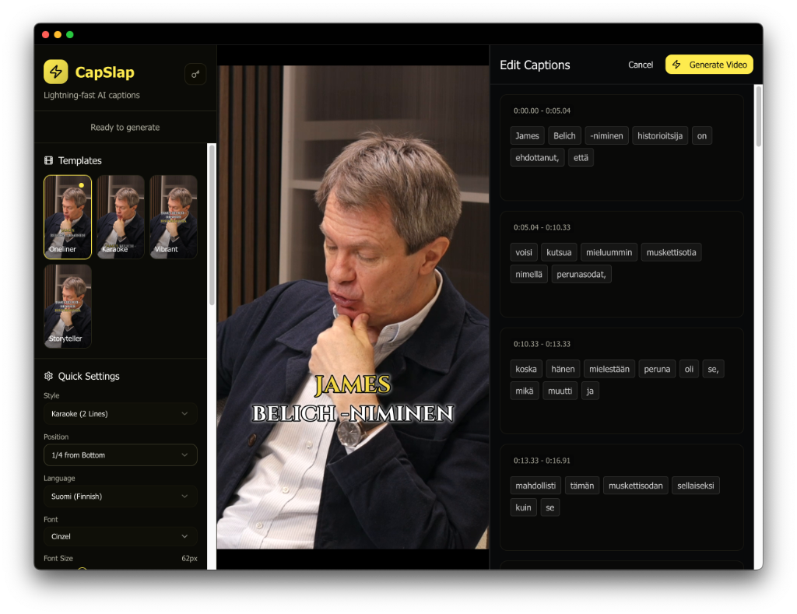

# CapSlap - AI Video Caption Generator

Automatically generate and burn captions into videos using AI transcription. **Works 100% offline** with local Whisper models.



## ✨ Features

- **🔒 100% Local/Offline** - All transcription runs locally using whisper.cpp. No cloud API required, your video never leaves your machine
- **👁️ Live Preview** - See exactly how your captions will look before exporting with real-time preview
- **🎨 30+ Custom Fonts** - Choose from a curated library organized by style:
  - **Modern / Sans** - Montserrat, Roboto, Open Sans, Lato, Raleway, Kanit, Poppins, WorkSans
  - **Display / Impact** - THEBOLDFONT, Bebas Neue, Anton, Lilita One, Oswald, Bangers
  - **Fun / Comic** - Komika Axis, Comic Neue, Fredoka, Chewy, Luckiest Guy
  - **Serif / Elegant** - Playfair Display, Merriweather, Lora, Cinzel, Bodoni Moda
  - **Handwritten / Script** - Permanent Marker, Patrick Hand, Amatic SC, Caveat Brush, Pacifico
- **📐 Adjustable Font Size** - Fine-tune caption size to fit your video style
- **🎬 Caption Templates** - Pre-built styles: Oneliner, Karaoke, Vibrant, Storyteller
- **🎯 Word-Level Timing** - Karaoke-style highlighting with precise word synchronization
- **📱 Export Formats** - 9:16 (TikTok/Reels), 16:9 (YouTube), 1:1 (Instagram), 4:5 (Feed posts)
- **🎥 Wide Format Support** - Works with MP4, MOV, WebM, AVI, WMV, FLV, MKV, MPEG, 3GP, and more
- **✏️ Caption Editor** - Full control over your captions before exporting:
  - Edit transcribed text with live preview
  - Shift words between segments to fix line breaks
  - View and adjust word-level timing
  - Double-click any segment to edit text directly
- **🌍 Multilingual** - Transcribe in 99+ languages including English, Spanish, French, German, Finnish, Japanese, and more

## Prerequisites

- **Rust**: https://rustup.rs/
- **Bun**: https://bun.sh/
- **FFmpeg** (auto-installed on macOS)

## Quick Start

1. **Clone the repository**

   ```bash
   git clone <repository-url>
   cd capslap
   ```

2. **Build Rust core**

   ```bash
   cd rust
   cargo build
   cd ..
   ```

3. **Install Electron dependencies**

   ```bash
   cd electron
   bun install
   ```

   FFmpeg will be automatically downloaded on macOS during `bun install`.

4. **Run the app**

   ```bash
   bun run dev
   ```

## Whisper Models (Local Transcription)

All transcription runs **100% locally** using whisper.cpp. Download models directly through the app UI, or manually:

```bash
mkdir -p rust/models

# Tiny model (fastest, 75 MB)
curl -L https://huggingface.co/ggerganov/whisper.cpp/resolve/main/ggml-tiny.bin \
  -o rust/models/ggml-tiny.bin

# Large v3 Turbo ⭐ RECOMMENDED (best speed/accuracy balance, 809 MB)
curl -L https://huggingface.co/ggerganov/whisper.cpp/resolve/main/ggml-large-v3-turbo.bin \
  -o rust/models/ggml-large-v3-turbo.bin

# Base model (lightweight, 142 MB)
curl -L https://huggingface.co/ggerganov/whisper.cpp/resolve/main/ggml-base.bin \
  -o rust/models/ggml-base.bin

# Small model (466 MB)
curl -L https://huggingface.co/ggerganov/whisper.cpp/resolve/main/ggml-small.bin \
  -o rust/models/ggml-small.bin
```

**No API key required!** OpenAI API is available as an optional fallback if you prefer cloud transcription.

## Adding More Fonts

Additional fonts can be downloaded using the included script:

```bash
./scripts/download_fonts.sh
```

This downloads fonts from Google Fonts to `rust/src/fonts/`.

## Platform-Specific Notes

### macOS

FFmpeg is automatically downloaded during `bun install` via the postinstall script.
